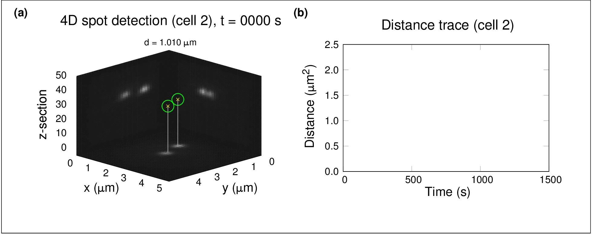
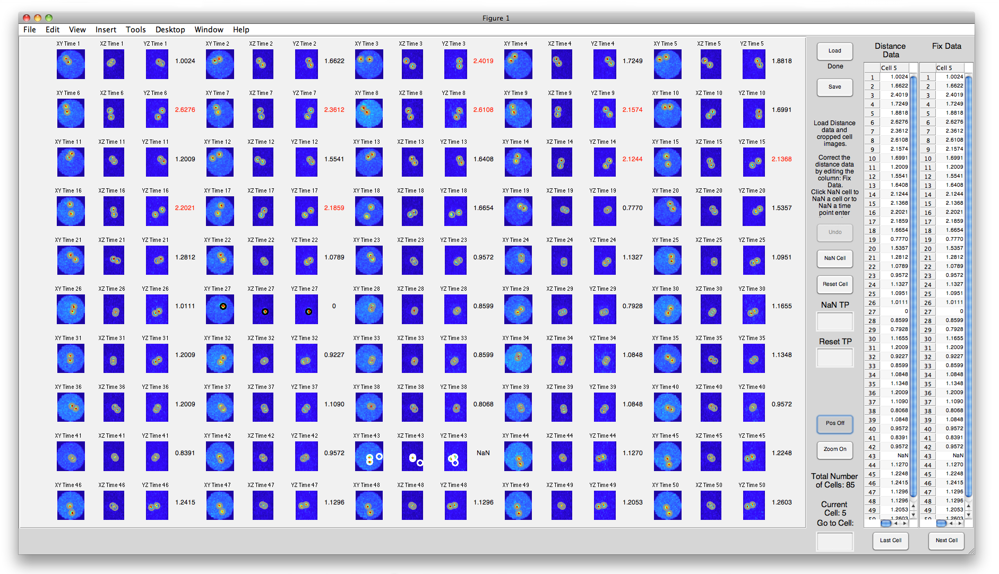
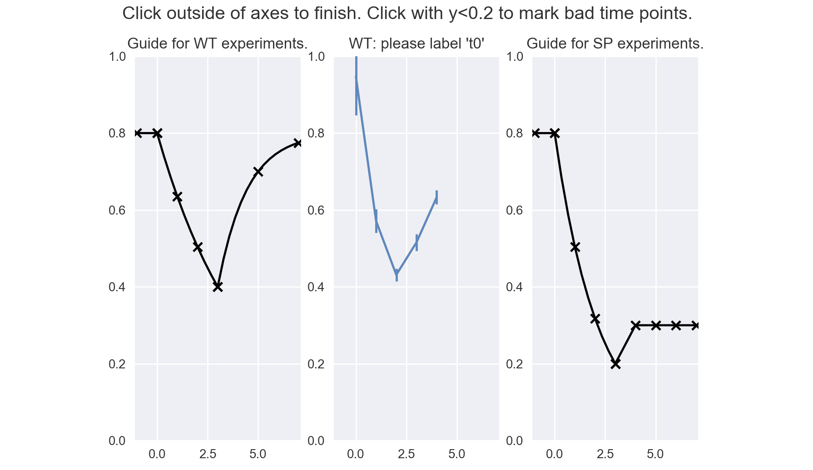

# :dog: SeeSpotRun
Newman T, Beltran B, McGehee J, Elnatan E, Cahoon CK, Paddy, MR, Chu DB, Spakowitz A*, and Burgess SM* (2022) Diffusion and distal linkages govern interchromosomal dynamics during meiotic prophase. PNAS, DOI: 10.1073/pnas.2115883119 



**Fig.** Animated figure illustrates live homolog pairing dynamics observed in *Saccharomyces cerevisiae*.

## Getting started

### Meiotic time course

* Samples were prepared for imaging following this [meiotic time course protocol](0_materials/meiotic_time_course.pdf).
* The microscope was started up as in [SDC startup and shutdown](0_materials/SDC_startup-shutdown.pdf).
* Imaging was peformed as in [Definite Focus instructions](0_materials/definite_focus.pdf). 
* Data was exported as in [Slidebook export](0_materials/slidebook_export.pdf).

### Video observations

* It is helpful to complete the [movie notes](0_materials/movie_notes_1.xlsx) to keep track of the QC and analysis process.
* An example, empty, directory structure is been provided ([example_folder](0_materials/example_folder)), for analyzing each movie; transfer the exported image planes to the `example_folder/1_raw_tiff/` directory.
* Depending on how the data was exported, you may need to rename the raw image files. [NameChanger for Mac](https://download.cnet.com/NameChanger/3000-2248_4-126364.html) is one tool that can be used for batch renaming files. At a minimum make sure that files end `*.tiff` and not `*_C0.tif`. 
* It is useful to view the movie as a z-MIP (maximum intensity projection over the z-axis) over time. 
	* If you created and exported z-MIPs in Slidebook, these can be kept in `example_folder/2_vid_mip/1_multi_MIP`.
		* Drag the z-MIPs for each timepoint into FIJI/ImageJ.
		* Click "Image" > "Stacks" > "Images to Stack".
		* Click "File" > "Save As" > "Tiff..."
		* Save in `example_folder/2_vid_mip/2_vid`
	* If you do not already have z-MIPs the lines of this [script](0_materials/VidCod3.txt), can be copied into the command prompt to generate a video in `example_folder/2_vid_mip/`.
	* Name video in the form `URA3WT3_t0_stack.tif`, if you adjust the brightness and contrast, save this as a separate file `_stackbc.tif`.
* The movie should be assessed for the quality of the signal to noise and the level of drift, in both the z dimension and the xy dimensions, with these observations recorded in the movie notes spreadsheet.
	* It can help to open all of the videos in FIJI/ImageJ at once to get an overview of the range of video quality in the timecourse.
	* The amount of drift in x and y should be assessed first overall (the general impression, in the `sum_vizdriftxy` column), then in terms of drift at the start (e.g. frames 1-16, the `vizdriftxy_start` column), in the middle (e.g. frames 17-32, the `vizdriftxy_mid` column), and end (e.g. frames 33-50, the `vizdriftxy_end` column) of the movie.
	* To assess the drift it is recommended that the user open the movie in ImageJ/FIJI and scrub back and forth, looking to see if all the foci in the field are translated across the field.
	* If drift is present at the start and/or end of the movie and is sufficiently bad to affect the users ability to crop out individual cells, then that video should be trimmed, with the included frames recorded in the movie notes, and only those frames imported into the `dist3D_gui` (below).
	* The [trim tool](0_materials/trimmer) may help one to see how removing certain frames affects the final zt-MIP.

## Spot calling

This part of the pipeline currently requires the commercial MATLAB software. An alternative, experimental, open-source GNU Octave spot calling pipeline is also available upon request.

### Installing Matlab add-ons

If you encounter dificulties drawing ellipses, check if you have the "Image Processing Toolbox" and "Medical Imaging Toolbox" add-ons installed. If not, then please install them. Select the "Apps" tab and click on "Get Add-Ons" to get to the "Add-on Explorer" that you can use to install them.

  
**Fig.** Accessing the "Add-on Explorer" interface

### Image segmentation and spot detection


The `dist3D_gui` function opens the image data and asks the user to crop each individual cell. This program then calculates the distance between detected foci for each cropped cell. The distance data are exported to a .csv file and the position data and cropped images are exported to a .mat file.

* Open MATLAB (here R2018a) from Applications.
* Change the current directory to `./SeeSpotRun/1_spot_calling/` (from this cloned repository) in the file browser.
* In the MATLAB command window, start the graphical user interface (GUI), by entering:
```matlab
dist3D_gui
```
* Enter the starting and ending time points into their respective fields. **NOTE:** Slidebook numbers the time points 0 to 49 but enter that range as 1 to 50. **NOTE:** Change these values if trimming for drift.
* Click “Load” and load the microscope images or click “Load Cells” to load the cropped cells .mat file. If you click “Load Cells” skip to the third to last step. **NOTE:** when selecting files always choose all the files (all z and t). This can be done by choosing the first image file, holding shift and choosing the last image file. **NOTE:** Do NOT include the log file in the files to open.
* Use the “ + ” and “ - “ buttons to adjust brightness. Adjust to allow you to best crop out the cells, then click “Done Adjusting”. At this point the brightness cannot be adjusted, but the user can restart if necessary.
* Click “Crop Background” and make a crop of any size, where there is not any signal. The ellipse can be resized using the resize marks and moved around by dragging. Double click in the ellipse to proceed. **NOTE:** when cropping, other buttons cannot be pushed until the crop is finished.
* Click “Crop Cell” and crop any cell, using the same method to crop the background. The space bar is a shortcut to “Crop Cell.” To undo a crop click “Undo Crop.” Space bar also acts as a short cut to “Undo Crop.” Click “Crop Cell” or click anywhere off “Undo Crop” to resume using space to crop.
* Repeat the above step for all cells the user wants to crop (usually as many as possible, however avoid cropping cells near the edge).
* Click “Done Cropping” when finished.
* Click “Save Figure” to save the numbered field of view image. **NOTE:** Enter name in the form `URA3WT3_t0_viewpost.png`, and save in `example_folder/4_dist_out/`.
	* If the user would like to quit and calculate the distance later, the user can click “Save” at this point to save a .mat file with the cropped cells. 
	* If the user would like to start the cropping over (only do if you are certain), click “Reset Cropping” .
* Click “Calculate Dist” to calculate the distance for each cell cropped. This button can only be clicked after having saved the figure. This can take a few minutes, depending on the number of cells cropped, the progress is updated after each cell.
* Click “Save” to save the .mat file, which has the distance data, cropped cell images, and the position data. The distance data is saved in a .csv file as well. **NOTE:** Enter name in the form `URA3WT3_t0`, and save in `example_folder/4_dist_out/`, the string `".mat"` and `"_dist.csv"` will be appended.
* Closing the window will close the GUI and can be done at any time, but the user will NOT be prompted to save and unsaved progress will be lost.

**NOTE:** The [ROI tool](0_materials/ROI5-2.ipynb) can be used to extract the coordinates of the cropped cells and make another view of the field.

### Spot confirmation



The `conf_gui` function allows the user to check the automatic fluorescent foci detection, and correct errors (as NaN: not a number). The distance should be 0 when only one focus is present and greater than 0 when two foci are present. Three or more foci will automatically result in NaN.

* In the MATLAB command window, change the current directory to the `./SeeSpotRun/1_spot_calling/` directory.
* Start the graphical user interface (GUI), by entering:
```matlab
conf_gui
```
* Click “Load” to load the variable (.mat) file with the distance data, cropped cells, and the position data, which should be the saved file from `dist3D_gui`.
* Asess the fluorescence intensity of the cropped region at each timepoint, looking for gross errors in computational spot detection. Err on the side of agreeing with the computational detection when the two spots are in close proximity. 
	* Click “Pos On” at any time to generate a circle on the image using the detected foci’s position, allowing the user to easily compare the detected foci with the image. 
	* Click “Zoom On” to allow the zoom function. When zoom is on, the cursor should change to a magnifying glass, however sometimes it does not. Click on a location in the image to zoom in, and double click to reset the image.
* Click on any entry in the “Fix Data” column and enter the value NaN where there is a mistake. This can be done by typing any non-numerical character.
	* Click “Undo” to undo the last user entry.
* If more than half of the measurements are NaN, use “NaN Cell” to fill all time points of the current cell with NaN values.
	* Click “Reset Cell” to restore the computer calculated values, or enter the time point into “NaN TP” or “Reset TP” to change all the values at the entered time point for all cells to NaN or to the computer calculated values respectively.
* Click “Next Cell” or “Last Cell” to go to the next cell or previous cell respectively, or alternatively, enter the number of the cell in the Go To Cell field. When changing cells, any changes become permanent and cannot be undone. However, the cell can still be reset if errors were made.
* Click “Save” to correct the position data and save the updated .mat file with the distance data and position data. Distance data is saved to a .csv file automatically as well.  **NOTE:** Enter name in the form `"URA3WT3_t0"`, and save in `example_folder/5_conf_out/`, the string `"_conf_dist.mat"` and `"_conf_dist.csv"` will be appended.
* **NOTE:** Closing the window will close the GUI and can be done at any time, but the user will NOT be prompted to save and unsaved progress will be lost.


## Cell observations

* Make a note of the number of objects that were cropped in the video and enter this value in the movie notes in the selobj_num column.
	* This value can be found by; observing the largest number printed on the `*_viewpost.png` image, counting the number of columns in the `*_dist.csv` spreadsheet, or opening the `"_conf_dist.mat"` data file and noting the number of distances or positions.
* Copy the [cell observations spreadsheet](0_materials/video_cells_obs.xlsx) into the `example_folder/3_cellobs/` folder, and rename in the form `URA3WT3_t0_cells_obs.xlsx`.
	* Fill out the Strain, Cond, Exp, t, and Cell columns, for the total number of cells cropped in that movie.
* Open the `*_viewpost.png` image indicating the position of that cell and the z-MIP video `*_stack.tif` in ImageJ/FIJI and adjust brightness to allow foci and faint nuclear/cellular autofluorescence to be observed.
* Identify the location of each cell using the `*_viewpost.png` image and observe that cell at each frame of the movie.
* Once a reasonable assessment has been made of whether a cell should be included in the subsequent analysis, record the cell observation in the `*_cells_obs.xlsx` file.
* Only cells noted as "Okay" ("okay", and some misspelt variant should also be detected) are included in the final datset. Cells might be excluded for any number of reasons, including:
	* "Edge": The cell is too close to the edge of the field and one focus moves outside of the field of view.
	* "Focus": The foci "flicker" suggesting that the cell is moving outside of the z capture range, this may also be an appropriate observation if one spot is much dimmer than the other.
	* "Okay": A second cell is so close to the cell under consideration, such that additional foci might have entered the cropped region.
	* "Anaphase": The cell undergoes cell division.
	* "Dead": The cell appears dead (or to die), based on high cytoplasmic autofluorescence, and no fluctuations in foci position.
* Make a note of the number of okay cells and dead cells in the movie notes spreadsheet, sorting the cell observations by the observations can make this easier.

## Generate pooled xyz file

Combine data from multiple videos together and arrange in a format for use by [multi-locus-analysis](https://github.com/brunobeltran/multi_locus_analysis).

* Copy all `*_conf.mat`, `*_conf_dist.csv`, and `*_cells_obs.xlsx` files to `./SeeSpotRun/2_xyz_gen/3_input/confy`.
	* **NOTE:** The filenames must be in the form `URA3WT3_t0_*`, with a four character strain (e.g. "URA3"), a two letter genotype (e.g. "WT"), an experiment number (e.g. 3), an underscore, and a meiosis time (e.g. "t0"). **NOTE:** Capitilization is also important, for instance use a lowercase "t" for the meiosis time.

* Open terminal and navigate to `./SeeSpotRun/2_xyz_gen/1_shell/`.

* **NOTE:** you may need to make the shell scripts executable with the commands `chmod u+x ./fullreset.sh` and `chmod u+x ./fullrun.sh`.

* Enter `"./fullreset.sh"` at command prompt to remove any previous runs.

* Enter `"./fullrun.sh"` at command prompt to run the program, the `xyz_conf_okaycells.csv` file should appear in `./SeeSpotRun/2_xyz_gen/7_out/`.


## Manual meiosis time



The [time normalization tool](3_time_norm/bp_timenorm.py) can be used to counter batch effects in meiosis progression.

* Open a terminal in the `./SeeSpotRun/3_time_norm/` folder, and run python 3.

* To run the GUI enter the following commands:

```python
import bp_timenorm as bp
bp.get_manual_meiosis_time_blind()
```

* The experimenter maps the experimentally observed pairing progression onto a preset curve.
	* The x position of the cursor when a click is made will be recorded as the normalized meiotic time.
	* The y position is not as critical, however one can click below y = 0.2 to indicate that there is low confidence in the score. 

* Principles for using the tool are to:
	* Match the height of the curve, by translating the time points horizontally.
	* Use the spo11 curve (lower percent paired) for the mutant and the heterozygote strain.
	* Only move forward, by not scoring a later chronological time point as having occurred before an earlier one.
	* Continue to rate each t<sub>\#</sub> for each experiment until at least two replicates of meiotic time are scored for each experiment, can keep track of this in a notepad.
	
* When the scoring has been done, click outside of the axes to export the normalized meiotic times to `./SeeSpotRun/3_time_norm/time_norm/`. 


## Other

### Manual spot calls

The process for performing manual spot calling, in order to assess whether there is a systematic error in the computational spot detection is noted in the [manual spot call instructions](0_materials/manual_spots.md).


### Anaphase counts

The process for recording the number of anaphase cells in a field of view is noted in the [anaphase count instructions](0_materials/anaphase_counts.md).


